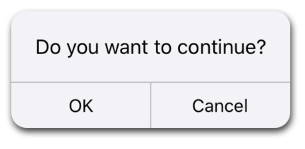
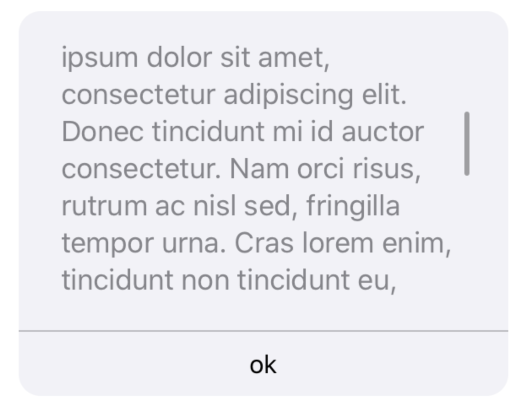
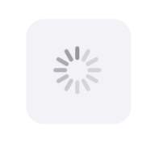
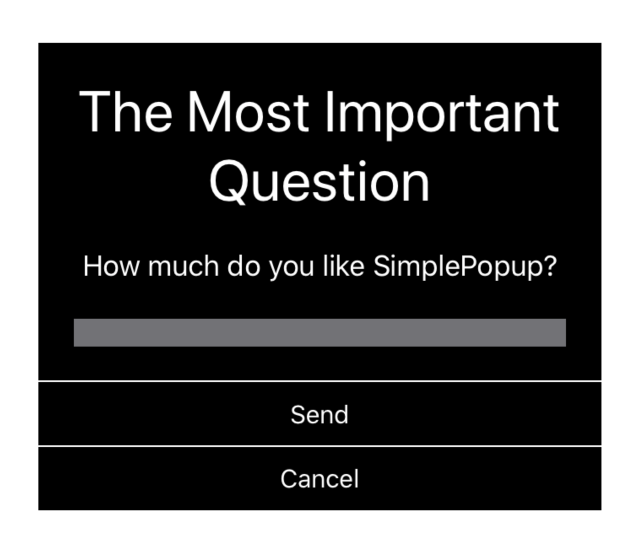

# SimplePopup

<p align="center">
    
    <a href="https://swift.org/package-manager">
        
    </a>
     
     =13.0-brightgreen.svg?style=flat" alt=">=13.0" />
</p>

SimplePopup - short description

## Installation

SimplePopup is distributed as a Swift package.


Add SimplePopup as a dependency to your `Package.swift` file. For more information, please see the [Swift Package Manager documentation](https://github.com/apple/swift-package-manager/tree/master/Documentation).

```
.package(url: "https://github.com/MMrepo/SimplePopup", from: "0.1.0")
```

## Usages

```swift
let popup1 = Popups.default(for: .common)
  .message("Do you want to continue?")
  .addDismissButton(title: "OK", color: .label)
  .addDismissButton(title: "Cancel", color: .label)
  .addShadow(radius: 3, color: .black, opacity: 0.8, offset: CGSize(width: 1, height: 3))
  .setActionButtons(orientation: .horizontal)
  .build()
```
 
 

```swift
 let longText = """
 Lorem ipsum dolor sit amet, consectetur adipiscing elit.
 Integer quis quam imperdiet orci maximus ultricies eget ut nulla.
 Aliquam nec vehicula libero, in suscipit odio. Lorem ipsum dolor sit amet,
 consectetur adipiscing elit. Donec tincidunt mi id auctor consectetur.
 Nam orci risus, rutrum ac nisl sed, fringilla tempor urna. Cras lorem enim,
 tincidunt non tincidunt eu, suscipit ut massa. Phasellus quam orci,
 fringilla eu nulla eu, euismod aliquet turpis. Morbi ut dictum purus.
 Suspendisse potenti. Pellentesque lobortis quam neque,
 at malesuada magna ornare vitae. Integer condimentum tortor vulputate,
 fermentum velit et, rhoncus mauris.
 """

 let popup2 = Popups.default(for: .common).messageScrollable(longText,
                                                             size: CGSize(width: 250, height: 150),
                                                             textColor: .secondaryLabel,
                                                             font: .preferredFont(forTextStyle: .body))
   .addDismissButton(title: "ok", color: .label)
   .build()
```


```swift
 let loading = Popups.default(for: .common).loading.build()
```


You can also easily build custom views using  provided builders, for example: 

```swift
let titleLabel = UILabel()
titleLabel.font = UIFont.preferredFont(forTextStyle: .largeTitle)
titleLabel.numberOfLines = 0
titleLabel.textColor = .white
titleLabel.text = "The Most Important Question"
titleLabel.textAlignment = .center
titleLabel.setContentCompressionResistancePriority(.required, for: .horizontal)
titleLabel.setContentCompressionResistancePriority(.required, for: .vertical)
titleLabel.setContentHuggingPriority(.defaultHigh, for: .horizontal)
titleLabel.setContentHuggingPriority(.defaultHigh, for: .vertical)

let bodyLabel = UILabel()
bodyLabel.font = UIFont.preferredFont(forTextStyle: .body)
bodyLabel.numberOfLines = 0
bodyLabel.textColor = .white
bodyLabel.text = "How much do you like SimplePopup?"
bodyLabel.textAlignment = .center
bodyLabel.setContentCompressionResistancePriority(.required, for: .horizontal)
bodyLabel.setContentCompressionResistancePriority(.required, for: .vertical)
bodyLabel.setContentHuggingPriority(.defaultHigh, for: .horizontal)
bodyLabel.setContentHuggingPriority(.defaultHigh, for: .vertical)

let input = UITextField()
input.font = UIFont.preferredFont(forTextStyle: .caption1)
input.textColor = .white
input.layer.borderWidth = 1
input.layer.borderColor = UIColor.black.cgColor
input.backgroundColor = UIColor.systemGray.withAlphaComponent(0.8)

let customPopup = Popups.common.get.stacked(views: [titleLabel, bodyLabel, input])
  .background(color: .black)
  .addBottomSeparator(color: .white, thickness: 1)
  .addButton(title: "Send", color: .white) { button, popup in
    // dismiss popup and handle input
  }.addDismissButton(title: "Cancel", color: .white)
  .setActionButtons(orientation: .vertical)
  .setActionButtons(separatorColor: .white)
  .build()
```


#### To present popup it's best to use:
```swift
let loading = Popups.default(for: .common).loading.build()
viewController.present(popup: loading, animated: true)
```

